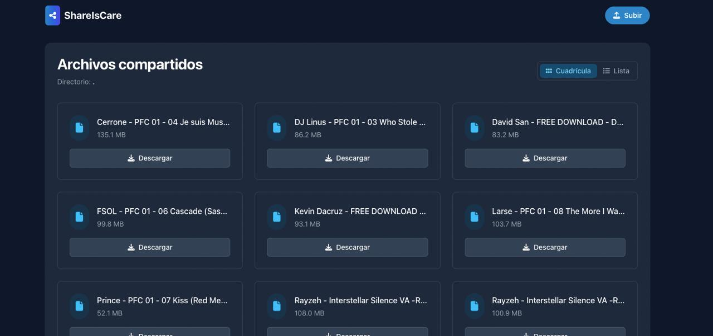

# ShareIsCare

ShareIsCare is a small application that works as an HTTP server to share files from a specific folder.

## Preview



## Features

- Simple and responsive web interface
- Configuration through YAML file
- Displays list of files with sizes
- Text file content visualization
- Configuration generation through command
- Implementation with templ templates
- Everything packaged in a single binary
- **Authentication system** to protect files
- Improved interface with dark mode
- **Cloudflare Tunnel integration** for secure remote access

## Installation

```bash
# Clone the repository
git clone https://github.com/rodrwan/shareiscare.git
cd shareiscare

# Method 1: Using Makefile (recommended)
make install       # Install dependencies
make build         # Compile the project
make init-config   # Generate default configuration

# Method 2: Manual commands
go mod tidy
go install github.com/a-h/templ/cmd/templ@latest
templ generate
go build -o shareiscare main.go
```

## Building and Development

The project includes a Makefile with several useful commands:

```bash
# Show help
make help

# Build the application
make build

# Run the application in development mode
make run
make dev

# Generate code from templ templates
make generate

# Build for different platforms
make build-linux
make build-windows
make build-mac
make cross-build    # Build for all platforms

# Other useful tasks
make clean         # Clean generated files
make deps          # Update dependencies
make init-config   # Generate default configuration file
```

## Configuration

Configuration is done through the `config.yaml` file. If it doesn't exist, it will be automatically created with default values when starting the application.

### Generate configuration with command

```bash
# Using make
make init-config

# Or directly with the executable
./shareiscare init

# Generate in a specific location
./shareiscare init my-config.yaml
```

### Configuration file structure

```yaml
# Example config.yaml
port: 8080           # Port on which the server will run
root_dir: "."        # Root directory to serve files
title: "ShareIsCare" # Title for the web interface
username: "admin"    # Username for authentication (change for security)
password: "shareiscare" # Password for authentication (change for security)
secret_key: "random_key" # Key for signing sessions (automatically generated)
hostname: # provided by the main binary when the app run for the first time
```

## Authentication

The application now includes an authentication system to protect files:

- Login is required to access files
- Default credentials: admin/shareiscare (change in config.yaml)
- The session is maintained via cookies signed with the secret key

## Usage

```bash
# View help
./shareiscare help

# Start the server
./shareiscare
```

Then open your browser at http://localhost:8080 to access the web interface.
Use the credentials configured in `config.yaml` to log in.

## Distribution

To distribute the application, simply build the binary and distribute it:

```bash
# Build for all platforms
make cross-build

# The binaries will be available in the ./build/ folder
```

## Creating Releases

El proyecto está configurado para generar releases automáticos en GitHub en dos escenarios:

### 1. Automáticamente al hacer merge a la rama main

Cada vez que se fusiona un Pull Request en la rama main, se activa un flujo de trabajo que:

1. Obtiene el último número de versión de los tags existentes (formato SemVer: v<major>.<minor>.<patch>)
2. Incrementa automáticamente el número de patch
3. Crea un tag de Git con ese número de versión
4. Compila binarios para todas las plataformas soportadas
5. Crea un release en GitHub con los binarios adjuntos

Este es el método recomendado para crear nuevos releases, ya que se integra con el flujo de desarrollo basado en Pull Requests.

### 2. Manualmente mediante tags (método alternativo)

También se puede crear un release manualmente:

```bash
# Crear un nuevo tag y release
make release v=1.0.0  # Reemplazar 1.0.0 con el número de versión deseado
```

Asegúrate de seguir el formato SemVer (v<major>.<minor>.<patch>) para mantener la consistencia.

Los releases estarán disponibles en la [página de releases](https://github.com/rodrwan/shareiscare/releases) del repositorio.

## Architecture

The project uses:
- Go as the base language
- Templ for HTML templates
- YAML for configuration
- Tailwind CSS for styles
- Native authentication system with sessions

The templates are compiled to Go code, allowing everything to be packaged in a single binary without external files.

## License

MIT

# Buy me a Coffee

<a href="https://buymeacoffee.com/roddotcom" target="_blank"></a>

## Cloudflare Tunnel Integration

ShareIsCare now supports Cloudflare Tunnel integration for secure remote access:

- Secure remote access to your files through Cloudflare's network
- No need to open ports on your firewall
- Automatic HTTPS with Cloudflare's SSL certificates
- Configuration through environment variables for security

To use Cloudflare Tunnel:

1. Install cloudflared on your system
2. Create a tunnel in Cloudflare Zero Trust dashboard
3. Configure the following environment variables before building the application:
   ```bash
    API_TOKEN=<api_token>
    ZONE_ID=<zone_id>
    DOMAIN=<domain>
    TUNNEL_NAME=<tunnel_name>
    TUNNEL_URL=<tunnel_url>
   ```
4. Build the application with these environment variables set

The application will automatically use the tunnel configuration when these environment variables are set during compilation.

Note: The tunnel configuration is embedded in the binary during compilation for security reasons and is not stored in the configuration file.
