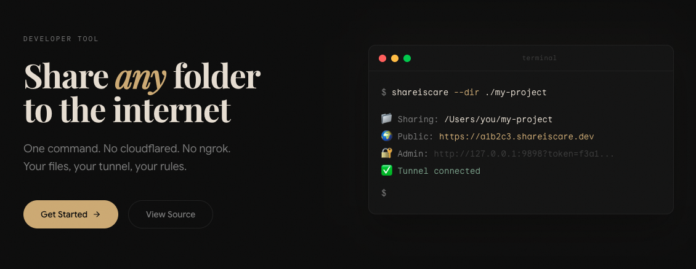

# shareiscare



Comparte cualquier carpeta de tu máquina local en internet con una URL pública
tipo `https://<hash>.shareiscare.dev`, sin instalar cloudflared ni ningún binario
externo. Todo el stack es tuyo: un Worker de Cloudflare y un pequeño binario Go.

```
Browser → *.shareiscare.dev → Worker (Durable Object) ←WebSocket→ tu máquina
```

---

## Tabla de contenidos

1. [Arquitectura](#1-arquitectura)
2. [Requisitos](#2-requisitos)
3. [Estructura del proyecto](#3-estructura-del-proyecto)
4. [Setup del Worker (una sola vez)](#4-setup-del-worker-una-sola-vez)
5. [Compilar el cliente Go](#5-compilar-el-cliente-go)
6. [Uso diario](#6-uso-diario)
7. [Cómo funciona por dentro](#7-cómo-funciona-por-dentro)
8. [Personalización](#8-personalización)
9. [Solución de problemas](#9-solución-de-problemas)

---

## 1. Arquitectura

```
┌─────────────┐   HTTPS    ┌──────────────────────────────┐
│   Browser   │ ─────────▶ │  Cloudflare Edge             │
│  (visitante)│            │  Worker: shareiscare         │
└─────────────┘            │  Durable Object: TunnelDO    │
                           │                              │
                           │  Una instancia DO por hash   │
                           │  Mantiene el WebSocket vivo  │
                           └──────────────┬───────────────┘
                                          │ WebSocket (wss://)
                                          │
                           ┌──────────────▼───────────────┐
                           │  shareiscare (binario Go)    │
                           │  corriendo en tu máquina     │
                           │                              │
                           │  ┌──────────────────────┐    │
                           │  │  http.FileServer +   │    │
                           │  │  directory UI        │    │
                           │  └──────────────────────┘    │
                           └──────────────────────────────┘
```

### Flujo de una request

1. El browser pide `https://miHash.shareiscare.dev/docs/`
2. El Worker recibe la request y la serializa a JSON (método, path, headers, body en base64)
3. El Worker envía ese JSON por el WebSocket al cliente Go conectado con ese hash
4. El cliente Go reconstruye un `http.Request` real y lo pasa al `http.FileServer` **en memoria** (sin tocar ningún puerto TCP local)
5. Captura la respuesta con un `ResponseRecorder`, la serializa a JSON y la devuelve por el WebSocket
6. El Worker deserializa y responde al browser con el `Response` original

### Por qué Durable Objects

Un Worker normal es stateless — no puede mantener una conexión WebSocket entre requests de distintos usuarios. Los Durable Objects son instancias con estado persistente en el edge. Cada hash (`miHash`) mapea a un DO único que vive mientras el cliente esté conectado y mantiene tanto el WebSocket local como el mapa de requests pendientes.

---

## 2. Requisitos

| Componente | Versión mínima | Para qué |
|---|---|---|
| Go | 1.21+ | compilar el cliente |
| Node.js | 18+ | desplegar el Worker con wrangler |
| Cuenta Cloudflare | Plan **Workers Paid** (~$5/mes) | Durable Objects requieren plan de pago |
| Dominio propio | cualquiera | en este caso `shareiscare.dev` — sustituye por el tuyo |

> **Nota sobre el plan:** El plan gratuito de Workers no incluye Durable Objects.
> Los primeros 1 millón de requests/mes y 1 GB·s de DO están incluidos en el plan Paid.
> Para uso personal/compartir archivos ocasionalmente no superarás esos límites.

---

## 3. Estructura del proyecto

```
shareiscare/
│
├── worker/                   # Cloudflare Worker — se despliega una sola vez
│   ├── wrangler.toml         # Configuración del Worker y rutas
│   └── src/
│       └── worker.js         # Lógica del broker WebSocket + Durable Object
│
└── client/                   # Binario Go — corre en tu máquina
    ├── main.go               # Servidor de archivos + cliente de tunnel
    ├── index.html            # UI embebida (go:embed)
    └── go.mod                # Dependencias Go
```

---

## 4. Setup del Worker (una sola vez)

### 4.1 Instalar wrangler

```bash
npm install -g wrangler
```

### 4.2 Autenticarse en Cloudflare

```bash
wrangler login
# Abre el browser para autorizar — sigue las instrucciones
```

### 4.3 Adaptar el dominio

Edita `worker/wrangler.toml` y cambia `shareiscare.dev` por tu dominio:

```toml
[[routes]]
pattern = "*.tudominio.com/*"
zone_name = "tudominio.com"
```

El dominio debe estar **activo en Cloudflare** (nameservers apuntando a CF).

### 4.4 Configurar el wildcard DNS

En el dashboard de Cloudflare → tu zona → DNS → Add record:

| Type | Name | IPv4 address | Proxy status |
|------|------|-------------|--------------|
| A    | *    | 192.0.2.1   | ✅ Proxied   |

La IP `192.0.2.1` es un placeholder — el Worker intercepta la request antes de
que llegue a cualquier servidor, así que la IP real no importa.

### 4.5 Desplegar el Worker

```bash
cd worker
npx wrangler deploy
```

Salida esperada:
```
✅ Deployed shareiscare to Cloudflare
   https://shareiscare.<tu-subdominio>.workers.dev
   *.tudominio.com/*
```

**El Worker solo se despliega una vez.** No hay que tocarlo de nuevo a menos que
quieras cambiar la lógica del broker.

---

## 5. Compilar el cliente Go

### 5.1 Instalar dependencias

```bash
cd client
go mod tidy
# Descarga github.com/gorilla/websocket
```

### 5.2 Compilar

```bash
# Para tu plataforma actual
go build -o shareiscare .

# Cross-compile para Linux (ej. desde macOS)
GOOS=linux GOARCH=amd64 go build -o shareiscare-linux .

# Para macOS ARM (Apple Silicon)
GOOS=darwin GOARCH=arm64 go build -o shareiscare-mac .

# Para Windows
GOOS=windows GOARCH=amd64 go build -o shareiscare.exe .
```

El binario resultante **incluye el `index.html` embebido** gracias a `//go:embed`.
No necesita ningún archivo adicional para funcionar.

---

## 6. Uso diario

### Sintaxis

```
./shareiscare --hash <identificador> --dir <ruta>
```

| Flag | Requerido | Default | Descripción |
|------|-----------|---------|-------------|
| `--hash` | ✅ | — | Identificador único del subdominio. Puede ser cualquier string URL-safe. Determina la URL pública: `https://<hash>.tudominio.com` |
| `--dir` | ❌ | `.` (directorio actual) | Ruta absoluta o relativa de la carpeta a compartir |

### Ejemplos

```bash
# Compartir el directorio actual
./shareiscare --hash miproyecto

# Compartir una carpeta específica
./shareiscare --hash fotos2024 --dir ~/Pictures/vacaciones

# Hash aleatorio (más privado)
./shareiscare --hash $(openssl rand -hex 6) --dir ./dist
```

### Salida al correr

```
📁 Sharing: /Users/rod/proyectos/mi-app
🌍 Public:  https://miproyecto.shareiscare.dev
✅ Tunnel connected
```

### Detener

`Ctrl+C` — el Worker detecta que el WebSocket se cerró y responderá `503` a
cualquier request hasta que vuelvas a conectar.

### Reconexión automática

Si se cae la conexión (red inestable, sleep del laptop, etc.), el cliente reconecta
automáticamente con backoff exponencial: 2s → 4s → 8s → ... → 60s máximo.

---

## 7. Cómo funciona por dentro

### El cliente Go

**`shareHandler`** implementa `http.Handler` y tiene dos rutas:

- `GET /__api/ls?path=<ruta>` → devuelve JSON con el listado del directorio.
  Ordena carpetas primero, luego archivos, ambos alfabéticamente.
  Filtra archivos ocultos (empiezan con `.`).

- `GET /*` → si la ruta apunta a un directorio, sirve el `index.html` embebido.
  Si apunta a un archivo, usa `http.ServeFile` que maneja Range requests,
  Content-Type, ETags y cache headers automáticamente.

**`responseRecorder`** es un `http.ResponseWriter` falso que captura el status
code, headers y body en memoria en vez de escribir a un socket TCP. Esto permite
pasar el request directamente al handler sin abrir ningún puerto local.

**`runTunnel`** abre un WebSocket hacia `wss://<hash>.tudominio.com/__tunnel_connect`.
El Worker reconoce ese path especial y lo redirige al Durable Object del hash.
El loop principal lee mensajes del WS, parsea el JSON del request, llama al
handler en una goroutine y envía la respuesta de vuelta.

### El Worker

**`TunnelDO`** (Durable Object) mantiene:
- `this.ws` — el WebSocket hacia el cliente local
- `this.pending` — `Map<requestId, {resolve, reject, timer}>` para las requests
  en vuelo

Cuando llega una request HTTP del browser:
1. Genera un UUID
2. Serializa la request a JSON y la manda al WS local
3. Crea una Promise y la guarda en `pending` con un timeout de 30s
4. Cuando llega el mensaje de respuesta del cliente, resuelve la Promise
5. Construye y devuelve el `Response` al browser

### La UI

Single-page app en HTML/JS vanilla (sin frameworks) embebida en el binario Go.
Usa `fetch('/__api/ls?path=...')` para listar directorios y `history.pushState`
para navegar sin recargar. Las animaciones son CSS puro (`@keyframes`).
Los iconos son emoji mapeados por extensión (~60 tipos cubiertos).

---

## 8. Personalización

### Cambiar el dominio

1. `worker/wrangler.toml`: actualiza `pattern` y `zone_name`
2. `client/main.go`: busca `shareiscare.dev` y reemplaza por tu dominio (2 ocurrencias)
3. `client/index.html`: busca `shareiscare.dev` (en el footer)
4. Recompila el cliente y redespliega el Worker

### Agregar autenticación básica

En `worker/src/worker.js`, antes de reenviar al cliente:

```js
// Al inicio del fetch(), después de extraer el hash:
const authHeader = request.headers.get("Authorization");
const expected   = "Bearer " + env.SECRET_TOKEN; // wrangler secret put SECRET_TOKEN
if (authHeader !== expected) {
  return new Response("Unauthorized", {
    status: 401,
    headers: { "WWW-Authenticate": "Bearer realm=\"shareiscare\"" }
  });
}
```

Agrega el secret con:
```bash
wrangler secret put SECRET_TOKEN
```

### Cambiar el estilo de la UI

Edita `client/index.html`. Las variables CSS están en `:root` al inicio del
`<style>`. Después de editar, recompila el binario Go para que el embed se
actualice:

```bash
go build -o shareiscare .
```

### Límite de tamaño de archivos

Los archivos grandes se transfieren en un solo mensaje WebSocket (actualmente
sin streaming). Para archivos > ~10 MB considera agregar chunking. El Worker
tiene un límite de CPU de 30ms por request en el plan gratuito, pero en Workers
Paid el límite es de 30 segundos — suficiente para la mayoría de casos.

---

## 9. Solución de problemas

### `tunnel: connect failed: dial tcp: no such host`
El Worker no está desplegado o el DNS wildcard no está configurado.
Verifica con: `dig +short @1.1.1.1 test.tudominio.com`

### `503 No hay cliente conectado`
El binario Go no está corriendo o se desconectó. Inicia `./shareiscare --hash ...`

### Los archivos se ven pero las subcarpetas dan 404
Verifica que el `--dir` apunte a la raíz correcta y que el usuario tenga permisos
de lectura sobre los subdirectorios.

### `Error: Durable Objects are not supported in your plan`
Necesitas activar el plan Workers Paid en el dashboard de Cloudflare.

### El Worker despliega pero no captura el wildcard
Asegúrate de que el registro DNS `*` esté en modo **Proxied** (nube naranja),
no DNS-only (nube gris).

### `go: module declares its path as: shareiscare`
El `go.mod` tiene `module shareiscare`. Si quieres renombrar el módulo:
```bash
# go.mod: module github.com/tuuser/shareiscare
# Luego:
go mod tidy
```

---

## Licencia

MIT — haz lo que quieras con esto.
